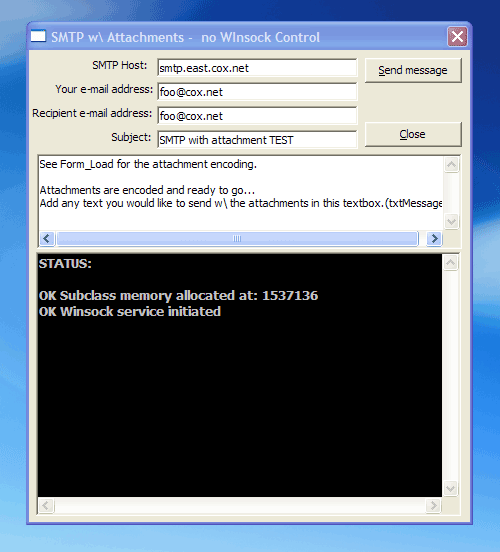



## SMTP w\\ No winsock Control\_Updated

### Description

Send e-mail using cSocketMaster.cls and VBIP's send mail example. No leaky MS Winsock control.

Now has MX Query and multiple attachmant support.
 
### More Info
 

             |
---                |---
**Submitted On**   |2005-08-03 19:42:58
**By**             |[cablehead\_](https://github.com/Planet-Source-Code/PSCIndex/blob/master/ByAuthor/cablehead.md)
**Level**          |Intermediate
**User Rating**    |4.3 (13 globes from 3 users)
**Compatibility**  |VB 4\.0 \(32\-bit\), VB 5\.0, VB 6\.0
**Category**       |[Miscellaneous](https://github.com/Planet-Source-Code/PSCIndex/blob/master/ByCategory/miscellaneous__1-1.md)
**World**          |[Visual Basic](https://github.com/Planet-Source-Code/PSCIndex/blob/master/ByWorld/visual-basic.md)
**Archive File**   |[SMTP\_w\_\_No192073832005\.zip](https://github.com/Planet-Source-Code/cablehead-smtp-w-no-winsock-control-updated__1-62063/archive/master.zip)

